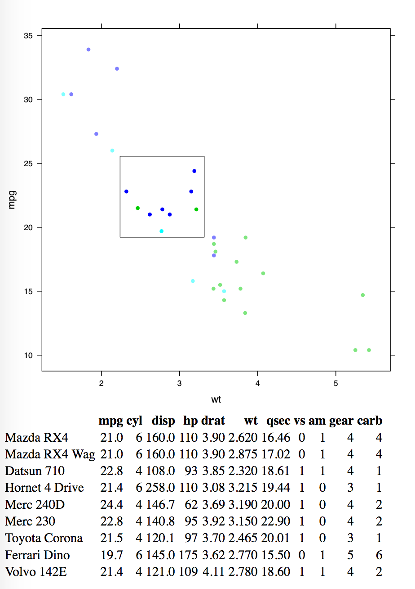
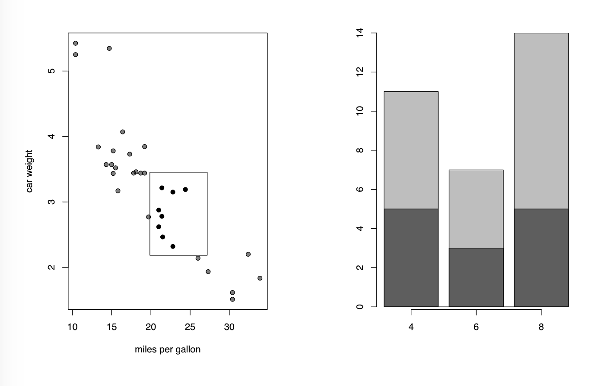
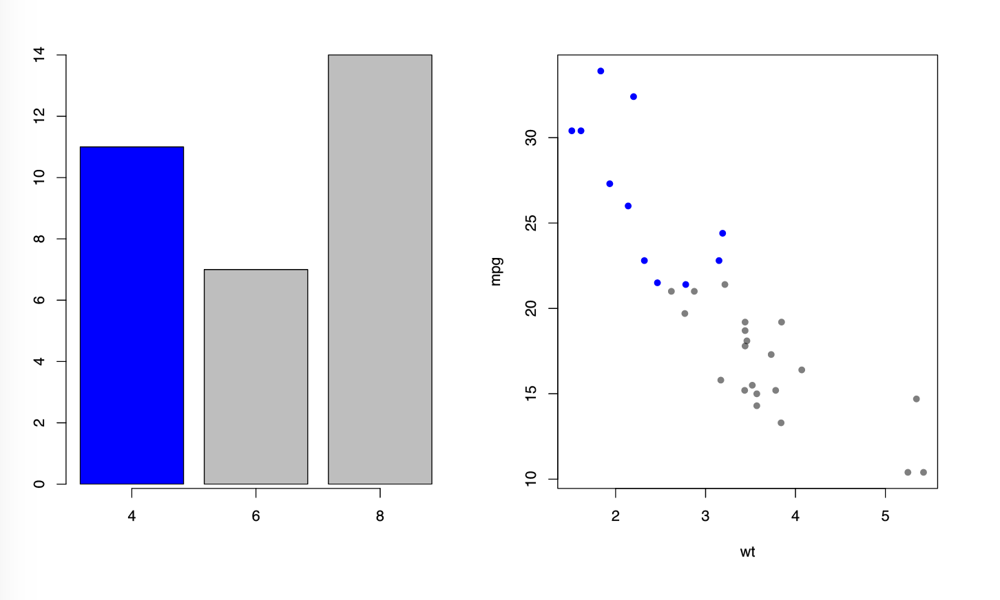
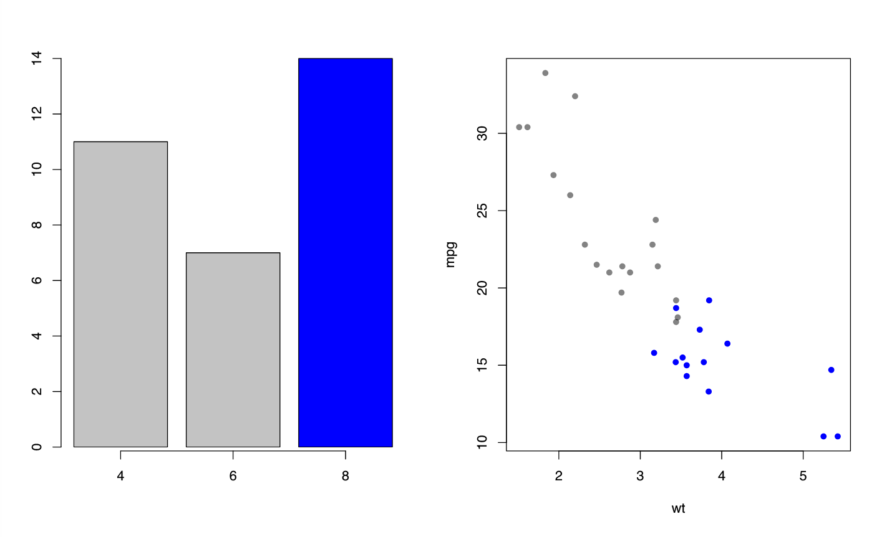

This section provides additional examples and acts as documentation of developing features
in the `interactr` package.

## Linking a plot to a table

With `interactr`, we can do this by explicitly adding a table and updating it
with a specific data frame.

When we select over a set of points, the table will update and show the information
about each point.



```{r, eval = FALSE}
library(lattice)
carplot <- xyplot(mpg ~ wt, data = mtcars, pch = 16, col = mtcars$gear)

listElements(carplot)
#send plot to browser
draw(carplot, new.page = TRUE)

#table
addTable(name = "tbl1", df = NULL)

# update table whenever selection box
returnTable <- function(index) {
  index <- as.numeric(unlist(strsplit(index, ",")))
  selected <- mtcars[index, ]
  updateTable("tbl1", selected)
}

# attach selection box:
boxIndex = boxCallback(returnTable)
addSelectionBox(plotNum = 1,
                el = "plot_01.xyplot.points.panel.1.1",
                f = "boxIndex")
```

---

## Highlighting bar plots

Linking between a selection box over a set of scatter points to a bar plot.



```{r, eval = FALSE}
# scatter and bar plot:
par(mfrow = c(1, 2))
plot(mtcars$mpg, mtcars$wt,
     pch = 19, xlab = "miles per gallon",
    ylab = "car weight")
barplot(table(mtcars$cyl))
pl <- recordPlot()
listElements(pl)
# send plots to browser:
draw(pl, new.page = TRUE)

#add invisible polygon to draw highlights
panel <- findPanel("graphics-plot-2-rect-1")
addPolygon("highlightRegion", panel, class = "highlight",
           attrs = list(fill = "black",
                        stroke = "black",
                        stroke.opacity = "1",
                        fill.opacity= "0.5"))

rectangleMe <- function(index) {
  index <- as.numeric(unlist(strsplit(index, ",")))
  selected <- mtcars[index, ]
  # compute points for linking bar plot together:
  pt <- computeBars("graphics-plot-2-rect-1", panel, selected, "cyl")
  #draw bar plot that highlights selected region:
  setPoints("highlightRegion", type = "coords", value = pt)

}

addSelectionBox(plotNum = 1,
                el = "graphics-plot-1-points-1",
                f = "boxIndex")
boxIndex = boxCallback(rectangleMe)
```

The implementation of this may possibly be extended to histograms (still a work in progress).

---

## Attaching the same interaction to a set of elements all at once

Originally, you could only attach a single interaction to 1 element. In `grid`,
some elements are actually referring to a group of elements (such as a `rect`
can be referring to the set of bars in a bar plot). Now, you can attach to a set
of these.
Below, we have attached hovers to a set of bars in a bar plot.

```{r, eval = FALSE}
 # draw plots in a single window
par(mfrow = c(1, 2))
barplot(table(mtcars$cyl))
with(mtcars, plot(wt, mpg, pch = 16))
pl <- recordPlot()
# list all elements from both plots
listElements(pl)
bars <- "graphics-plot-1-rect-1"
# attach hover effects to bars on the bar plot
interactions <- list(hover = styleHover(attrs = list(fill = "blue", fill.opacity = "1")))
draw(pl, bars, interactions, new.page = TRUE)
```

We can go further and link the bars to the scatter plot.

```{r, eval = FALSE}
points <- "graphics-plot-2-points-1"

highlightPoints <- function(ptr) {
  # obtain the index of these bars, which is stored in node pointers:
  index <- as.numeric(ptr)
  groups <- sort(unique(mtcars$cyl))
  ind <- which(mtcars$cyl == groups[index])
  nd <- which(mtcars$cyl != groups[index])
  # set points on scatter plot based upon index
  setPoints(points, type = "index", value = ind,
            attrs = list(fill = "blue",
                         fill.opacity = "1",
                         class = "selected"))
  setPoints(points, type = "index", value = nd,
            attrs = list(fill = "black",
                         fill.opacity = "0.5",
                         class = ""))
}
int <- list(onclick = "highlightPoints")
addInteractions(bars, int)
```




A downside to this is that it starts to crawl when there are more points/elements to handle.
Might look into ways to try speed it up.

If there is a need for targeting a single element within a group, there may be
a way around it in the future.

---

## Other ideas in the works...

So far, we've established that the selection box feature only works over points (that is,
only restricted to scatter plots and dot plots). What if you could select over aggregated
plots (i.e. box plots, density plots...?)
- Linking between facetted/trellis plots produced by `lattice`
- Linking more than 2 plots
